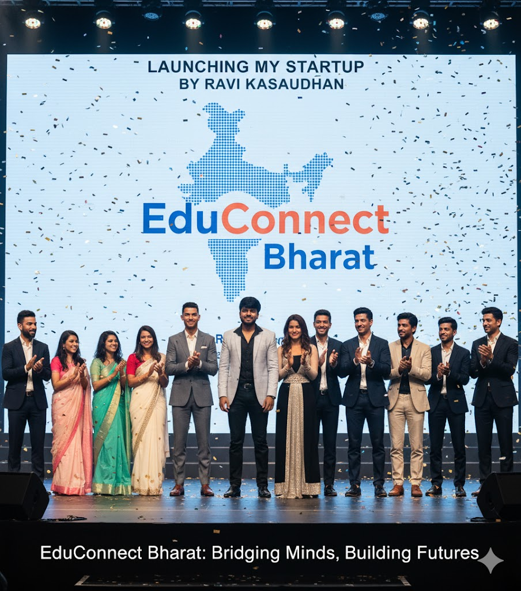

# 🚀 AI EduConnect - Smart Learning Platform

<div align="center">
<div align="center">



</div>


AI EduConnect is an innovative AI-powered education platform transforming learning across India...


**AI-Powered Education Platform Connecting Students Across India**
apple-touch-icon.png

[](https://educonnectbharat.netlify.app)
[](https://github.com/yourusername/ai-educonnect)

</div>

## 📖 Table of Contents
- [Problem Statement](#problem-statement)
- [Solution](#solution)
- [Key Features](#key-features)
- [Tech Stack](#tech-stack)
- [Installation](#installation)
- [Usage](#usage)
- [Project Structure](#project-structure)
- [Contributing](#contributing)
- [License](#license)

- 
- ai-educonnect/
├── index.html                 # Main application entry point
├── style.css                  # Global styles and responsive design
├── script.js                  # Core application logic
├── manifest.json              # PWA configuration
├── sw.js                      # Service Worker for offline support
├── assets/
│   ├── icons/
│   │   ├── icon-192.png       # PWA icon small
│   │   └── icon-512.png       # PWA icon large
│   └── images/                # Application images
├── modules/
│   ├── auth.js               # Authentication system
│   ├── chat.js               # AI chatbot functionality
│   └── storage.js            # Local storage management
└── README.md                 # Project documentation

## 🎯 Problem Statement

### Educational Challenges in India:
1. **Limited Access** - Quality education restricted to urban areas
2. **Career Guidance Gap** - 70% students lack proper career counseling
3. **Skill Mismatch** - Industry requirements vs academic curriculum gap
4. **Resource Scattering** - Learning materials spread across multiple platforms
5. **Connectivity Issues** - Limited internet access in rural areas

## 💡 Our Solution

**AI EduConnect** - A comprehensive AI-powered platform addressing India's education challenges:

- 🤖 **AI Career Assistant** - 24/7 personalized guidance
- 📱 **PWA Technology** - Works offline in low-connectivity areas
- 👥 **Collaborative Learning** - Peer-to-peer project sharing
- 🎓 **Skill Development** - Workshops, courses & practical projects
- 🛒 **Educational Marketplace** - Affordable learning resources

## ✨ Key Features

### 🎓 Learning Modules
- **Smart Feed** - Community interactions & knowledge sharing
- **Project Hub** - Showcase and collaborate on projects
- **Workshop Portal** - Live sessions with industry experts
- **Course Library** - Structured learning paths
- **AI Assistant** - Instant doubt solving & career guidance

### 🛠 Technical Features
- **Progressive Web App** - Installable, works offline
- **AI Integration** - Smart chatbot for personalized support
- **Real-time Collaboration** - Live project sharing & feedback
- **Mobile-First Design** - Optimized for Indian smartphone users
- **Cross-Platform** - Works on all devices & browsers

### 💼 Career Support
- **Resume Builder** - ATS-friendly resume generation
- **Interview Prep** - AI-powered mock interviews
- **Skill Assessment** - Gap analysis & improvement suggestions
- **Job Matching** - Connect with relevant opportunities

## 🛠 Tech Stack

### Frontend
- **HTML5** - Semantic markup & accessibility
- **CSS3** - Modern styling with Flexbox/Grid
- **JavaScript ES6+** - Interactive functionality
- **PWA** - Service Workers, Manifest, Offline support

### AI & Backend
- **Machine Learning** - Custom chatbot implementation
- **Local Storage** - Client-side data persistence
- **RESTful Architecture** - Scalable API design

### Deployment
- **Netlify** - Continuous deployment
- **GitHub Pages** - Static hosting
- **CDN** - Global content delivery

## 🚀 Installation

### Prerequisites
- Modern web browser (Chrome 80+, Firefox 75+, Safari 13+)
- Node.js (for development)
- Git (for version control)

### Quick Start
```bash
# Clone the repository
git clone https://github.com/yourusername/ai-educonnect.git

# Navigate to project directory
cd ai-educonnect

# Open in browser
open index.html

# Or use live server for development
npx live-server
